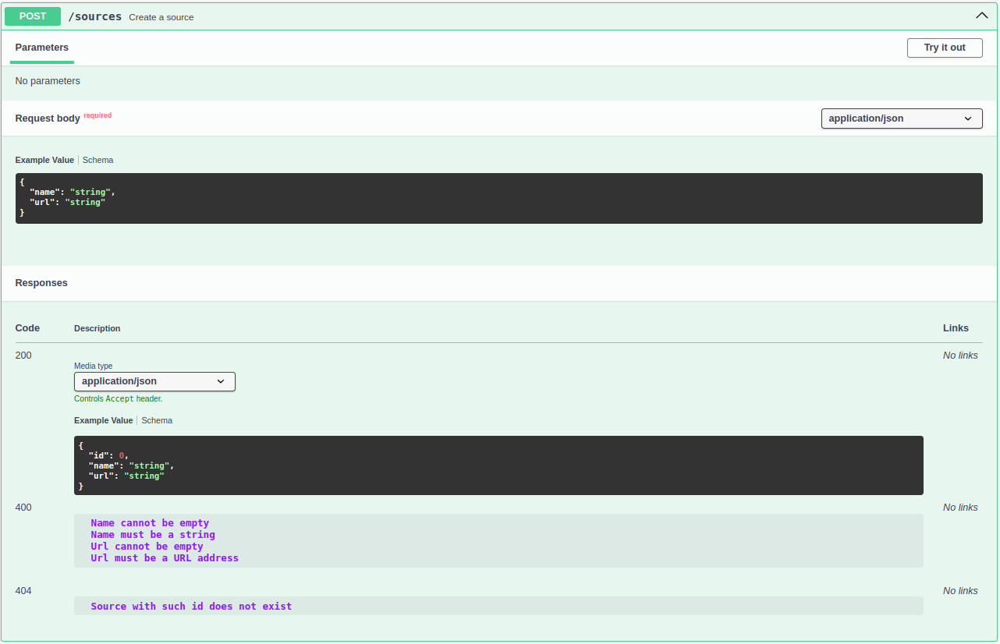
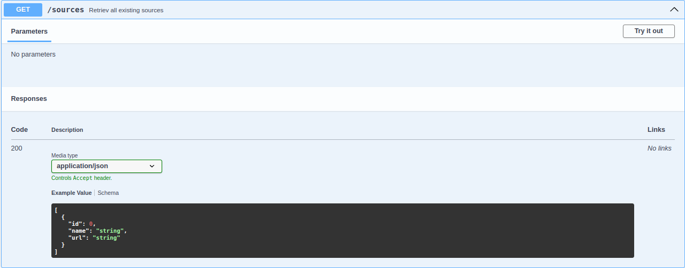
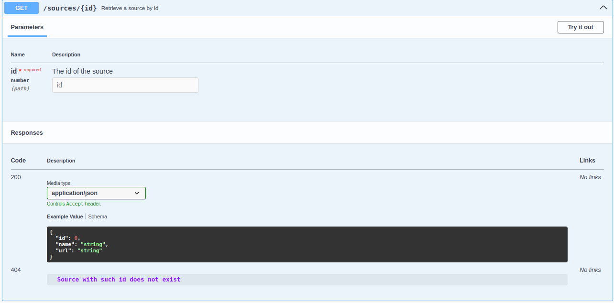
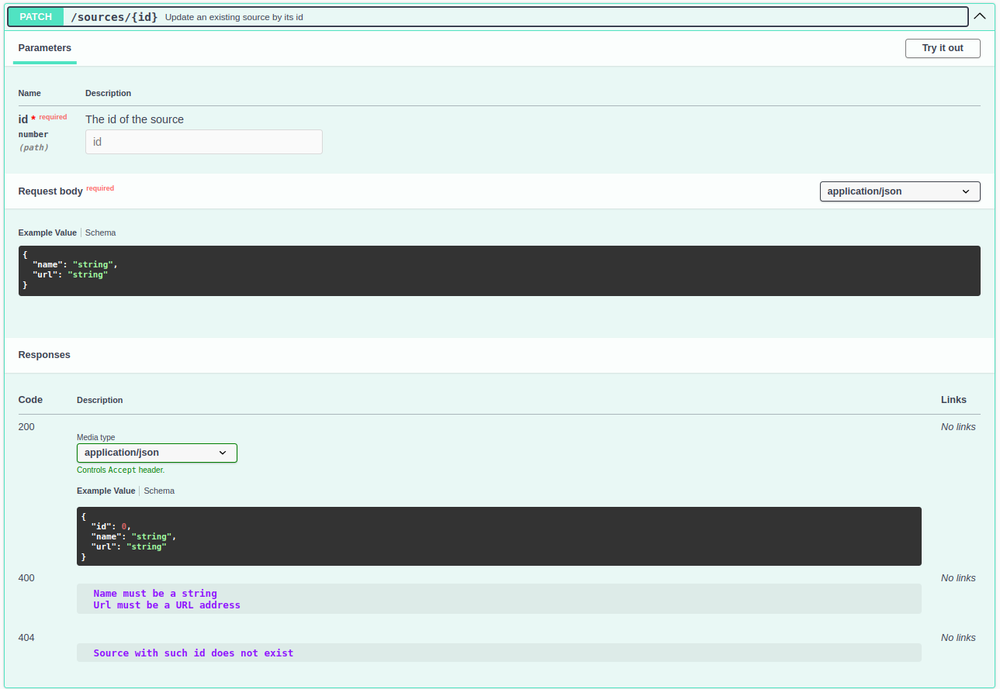
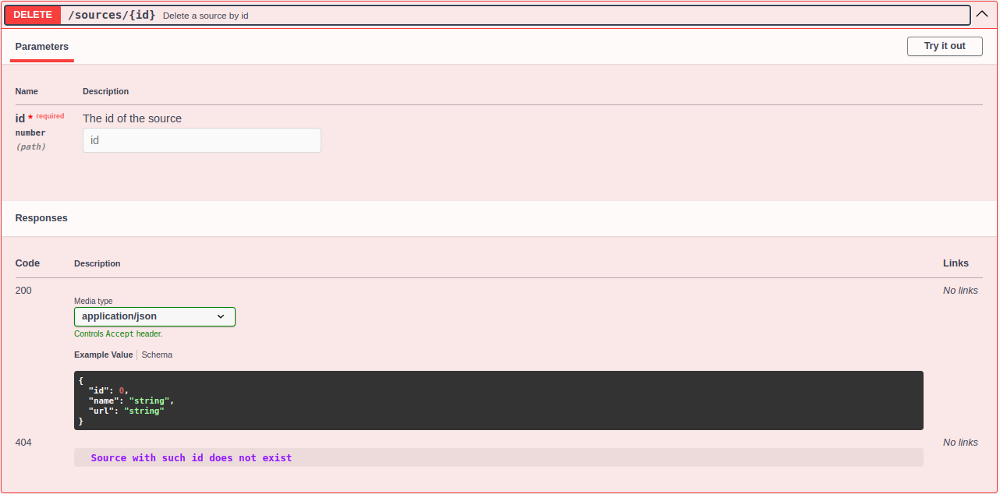

# Реалізація інформаційного та програмного забезпечення

## SQL-скрипт для створення початкового наповнення бази даних

```sql
-- MySQL Script generated by MySQL Workbench
-- Sun 05 Nov 2023 02:19:32 PM EET
-- Model: New Model    Version: 1.0
-- MySQL Workbench Forward Engineering

SET @OLD_UNIQUE_CHECKS=@@UNIQUE_CHECKS, UNIQUE_CHECKS=0;
SET @OLD_FOREIGN_KEY_CHECKS=@@FOREIGN_KEY_CHECKS, FOREIGN_KEY_CHECKS=0;
SET @OLD_SQL_MODE=@@SQL_MODE, SQL_MODE='ONLY_FULL_GROUP_BY,STRICT_TRANS_TABLES,NO_ZERO_IN_DATE,NO_ZERO_DATE,ERROR_FOR_DIVISION_BY_ZERO,NO_ENGINE_SUBSTITUTION';

-- -----------------------------------------------------
-- Schema mydb
-- -----------------------------------------------------

-- -----------------------------------------------------
-- Schema mydb
-- -----------------------------------------------------
CREATE SCHEMA IF NOT EXISTS `mydb` DEFAULT CHARACTER SET utf8 ;
USE `mydb` ;

-- -----------------------------------------------------
-- Table `mydb`.`action`
-- -----------------------------------------------------
DROP TABLE IF EXISTS `mydb`.`action` ;

CREATE TABLE IF NOT EXISTS `mydb`.`action` (
  `craeted_at` DATETIME NOT NULL,
  `state_id` INT NOT NULL,
  `media_request_id` INT NOT NULL,
  `source_id` INT NOT NULL,
  `user_id` INT NOT NULL,
  PRIMARY KEY (`state_id`, `media_request_id`, `source_id`, `user_id`),
  INDEX `fk_action_media_request1_idx` (`media_request_id` ASC) VISIBLE,
  INDEX `fk_action_source1_idx` (`source_id` ASC) VISIBLE,
  INDEX `fk_action_user1_idx` (`user_id` ASC) VISIBLE,
  CONSTRAINT `fk_action_state1`
    FOREIGN KEY (`state_id`)
    REFERENCES `mydb`.`state` (`id`)
    ON DELETE NO ACTION
    ON UPDATE NO ACTION,
  CONSTRAINT `fk_action_media_request1`
    FOREIGN KEY (`media_request_id`)
    REFERENCES `mydb`.`media_request` (`id`)
    ON DELETE NO ACTION
    ON UPDATE NO ACTION,
  CONSTRAINT `fk_action_source1`
    FOREIGN KEY (`source_id`)
    REFERENCES `mydb`.`source` (`id`)
    ON DELETE NO ACTION
    ON UPDATE NO ACTION,
  CONSTRAINT `fk_action_user1`
    FOREIGN KEY (`user_id`)
    REFERENCES `mydb`.`user` (`id`)
    ON DELETE NO ACTION
    ON UPDATE NO ACTION)
ENGINE = InnoDB;


-- -----------------------------------------------------
-- Table `mydb`.`based_on`
-- -----------------------------------------------------
DROP TABLE IF EXISTS `mydb`.`based_on` ;

CREATE TABLE IF NOT EXISTS `mydb`.`based_on` (
  `source_id` INT NOT NULL,
  `media_request_id` INT NOT NULL,
  PRIMARY KEY (`source_id`, `media_request_id`),
  INDEX `fk_source_has_media_request_media_request1_idx` (`media_request_id` ASC) VISIBLE,
  INDEX `fk_source_has_media_request_source1_idx` (`source_id` ASC) VISIBLE,
  CONSTRAINT `fk_source_has_media_request_source1`
    FOREIGN KEY (`source_id`)
    REFERENCES `mydb`.`source` (`id`)
    ON DELETE NO ACTION
    ON UPDATE NO ACTION,
  CONSTRAINT `fk_source_has_media_request_media_request1`
    FOREIGN KEY (`media_request_id`)
    REFERENCES `mydb`.`media_request` (`id`)
    ON DELETE NO ACTION
    ON UPDATE NO ACTION)
ENGINE = InnoDB;


-- -----------------------------------------------------
-- Table `mydb`.`feedback`
-- -----------------------------------------------------
DROP TABLE IF EXISTS `mydb`.`feedback` ;

CREATE TABLE IF NOT EXISTS `mydb`.`feedback` (
  `id` INT NOT NULL,
  `body` VARCHAR(255) NULL,
  `rating` FLOAT NOT NULL,
  `created_at` DATETIME NOT NULL,
  `updated_at` DATETIME NOT NULL,
  `media_request_id` INT NOT NULL,
  `user_id` INT NOT NULL,
  PRIMARY KEY (`id`, `user_id`, `media_request_id`),
  INDEX `fk_Feedback_MediaRequest1_idx` (`media_request_id` ASC) VISIBLE,
  INDEX `fk_Feedback_User1_idx` (`user_id` ASC) VISIBLE,
  CONSTRAINT `fk_Feedback_MediaRequest1`
    FOREIGN KEY (`media_request_id`)
    REFERENCES `mydb`.`media_request` (`id`)
    ON DELETE NO ACTION
    ON UPDATE NO ACTION,
  CONSTRAINT `fk_Feedback_User1`
    FOREIGN KEY (`user_id`)
    REFERENCES `mydb`.`user` (`id`)
    ON DELETE NO ACTION
    ON UPDATE NO ACTION)
ENGINE = InnoDB;


-- -----------------------------------------------------
-- Table `mydb`.`label`
-- -----------------------------------------------------
DROP TABLE IF EXISTS `mydb`.`label` ;

CREATE TABLE IF NOT EXISTS `mydb`.`label` (
  `tag_id` INT NOT NULL,
  `source_id` INT NOT NULL,
  PRIMARY KEY (`tag_id`, `source_id`),
  INDEX `fk_tag_has_source_source1_idx` (`source_id` ASC) VISIBLE,
  INDEX `fk_tag_has_source_tag1_idx` (`tag_id` ASC) VISIBLE,
  CONSTRAINT `fk_tag_has_source_tag1`
    FOREIGN KEY (`tag_id`)
    REFERENCES `mydb`.`tag` (`id`)
    ON DELETE NO ACTION
    ON UPDATE NO ACTION,
  CONSTRAINT `fk_tag_has_source_source1`
    FOREIGN KEY (`source_id`)
    REFERENCES `mydb`.`source` (`id`)
    ON DELETE NO ACTION
    ON UPDATE NO ACTION)
ENGINE = InnoDB;


-- -----------------------------------------------------
-- Table `mydb`.`media_request`
-- -----------------------------------------------------
DROP TABLE IF EXISTS `mydb`.`media_request` ;

CREATE TABLE IF NOT EXISTS `mydb`.`media_request` (
  `id` INT NOT NULL,
  `name` VARCHAR(255) NOT NULL,
  `description` VARCHAR(255) NULL,
  `keywords` VARCHAR(255) NULL,
  `type` VARCHAR(255) NOT NULL,
  `created_at` DATETIME NOT NULL,
  `updated_at` DATETIME NOT NULL,
  `user_id` INT NOT NULL,
  `source_id` INT NOT NULL,
  PRIMARY KEY (`id`, `user_id`, `source_id`))
ENGINE = InnoDB;


-- -----------------------------------------------------
-- Table `mydb`.`permission`
-- -----------------------------------------------------
DROP TABLE IF EXISTS `mydb`.`permission` ;

CREATE TABLE IF NOT EXISTS `mydb`.`permission` (
  `id` INT NOT NULL,
  `name` VARCHAR(255) NOT NULL,
  PRIMARY KEY (`id`))
ENGINE = InnoDB;


-- -----------------------------------------------------
-- Table `mydb`.`role`
-- -----------------------------------------------------
DROP TABLE IF EXISTS `mydb`.`role` ;

CREATE TABLE IF NOT EXISTS `mydb`.`role` (
  `id` INT NOT NULL,
  `name` VARCHAR(255) NOT NULL,
  `description` VARCHAR(255) NULL,
  PRIMARY KEY (`id`))
ENGINE = InnoDB;


-- -----------------------------------------------------
-- Table `mydb`.`role_has_permission`
-- -----------------------------------------------------
DROP TABLE IF EXISTS `mydb`.`role_has_permission` ;

CREATE TABLE IF NOT EXISTS `mydb`.`role_has_permission` (
  `role_id` INT NOT NULL,
  `permission_id` INT NOT NULL,
  PRIMARY KEY (`role_id`, `permission_id`),
  INDEX `fk_Role_has_Permission_Permission1_idx` (`permission_id` ASC) VISIBLE,
  INDEX `fk_Role_has_Permission_Role1_idx` (`role_id` ASC) VISIBLE,
  CONSTRAINT `fk_Role_has_Permission_Role1`
    FOREIGN KEY (`role_id`)
    REFERENCES `mydb`.`role` (`id`)
    ON DELETE NO ACTION
    ON UPDATE NO ACTION,
  CONSTRAINT `fk_Role_has_Permission_Permission1`
    FOREIGN KEY (`permission_id`)
    REFERENCES `mydb`.`permission` (`id`)
    ON DELETE NO ACTION
    ON UPDATE NO ACTION)
ENGINE = InnoDB;


-- -----------------------------------------------------
-- Table `mydb`.`source`
-- -----------------------------------------------------
DROP TABLE IF EXISTS `mydb`.`source` ;

CREATE TABLE IF NOT EXISTS `mydb`.`source` (
  `id` INT NOT NULL,
  `name` VARCHAR(255) NOT NULL,
  `url` VARCHAR(255) NOT NULL,
  PRIMARY KEY (`id`))
ENGINE = InnoDB;


-- -----------------------------------------------------
-- Table `mydb`.`state`
-- -----------------------------------------------------
DROP TABLE IF EXISTS `mydb`.`state` ;

CREATE TABLE IF NOT EXISTS `mydb`.`state` (
  `id` INT NOT NULL,
  `display_name` VARCHAR(255) NOT NULL,
  PRIMARY KEY (`id`))
ENGINE = InnoDB;


-- -----------------------------------------------------
-- Table `mydb`.`tag`
-- -----------------------------------------------------
DROP TABLE IF EXISTS `mydb`.`tag` ;

CREATE TABLE IF NOT EXISTS `mydb`.`tag` (
  `id` INT NOT NULL,
  `name` VARCHAR(255) NOT NULL,
  PRIMARY KEY (`id`))
ENGINE = InnoDB;


-- -----------------------------------------------------
-- Table `mydb`.`user`
-- -----------------------------------------------------
DROP TABLE IF EXISTS `mydb`.`user` ;

CREATE TABLE IF NOT EXISTS `mydb`.`user` (
  `id` INT NOT NULL,
  `first_name` VARCHAR(255) NOT NULL,
  `last_name` VARCHAR(255) NOT NULL,
  `username` VARCHAR(255) NOT NULL,
  `email` VARCHAR(255) NOT NULL,
  `password` VARCHAR(255) NOT NULL,
  `role_id` INT NOT NULL,
  PRIMARY KEY (`id`, `role_id`),
  INDEX `fk_User_Role1_idx` (`role_id` ASC) VISIBLE,
  UNIQUE INDEX `username_UNIQUE` (`username` ASC) VISIBLE,
  UNIQUE INDEX `email_UNIQUE` (`email` ASC) VISIBLE,
  CONSTRAINT `fk_User_Role1`
    FOREIGN KEY (`role_id`)
    REFERENCES `mydb`.`role` (`id`)
    ON DELETE NO ACTION
    ON UPDATE NO ACTION)
ENGINE = InnoDB;


SET SQL_MODE=@OLD_SQL_MODE;
SET FOREIGN_KEY_CHECKS=@OLD_FOREIGN_KEY_CHECKS;
SET UNIQUE_CHECKS=@OLD_UNIQUE_CHECKS;

-- -----------------------------------------------------
-- Data for table `mydb`.`permission`
-- -----------------------------------------------------
START TRANSACTION;
USE `mydb`;
INSERT INTO `mydb`.`permission` (`id`, `name`) VALUES (1, 'user.delete');
INSERT INTO `mydb`.`permission` (`id`, `name`) VALUES (2, 'user.role.promote');
INSERT INTO `mydb`.`permission` (`id`, `name`) VALUES (3, 'media.find');
INSERT INTO `mydb`.`permission` (`id`, `name`) VALUES (4, 'media.create');
INSERT INTO `mydb`.`permission` (`id`, `name`) VALUES (5, 'media.delete');
INSERT INTO `mydb`.`permission` (`id`, `name`) VALUES (6, 'media.edit');
INSERT INTO `mydb`.`permission` (`id`, `name`) VALUES (7, 'media.feedback.add');

COMMIT;


-- -----------------------------------------------------
-- Data for table `mydb`.`role`
-- -----------------------------------------------------
START TRANSACTION;
USE `mydb`;
INSERT INTO `mydb`.`role` (`id`, `name`, `description`) VALUES (1, 'User', 'An ordinary user of the system');
INSERT INTO `mydb`.`role` (`id`, `name`, `description`) VALUES (2, 'TechnicalExpert', 'Specialist in technical issues');

COMMIT;


-- -----------------------------------------------------
-- Data for table `mydb`.`role_has_permission`
-- -----------------------------------------------------
START TRANSACTION;
USE `mydb`;
INSERT INTO `mydb`.`role_has_permission` (`role_id`, `permission_id`) VALUES (2, 1);
INSERT INTO `mydb`.`role_has_permission` (`role_id`, `permission_id`) VALUES (2, 2);
INSERT INTO `mydb`.`role_has_permission` (`role_id`, `permission_id`) VALUES (1, 3);
INSERT INTO `mydb`.`role_has_permission` (`role_id`, `permission_id`) VALUES (2, 3);
INSERT INTO `mydb`.`role_has_permission` (`role_id`, `permission_id`) VALUES (1, 4);
INSERT INTO `mydb`.`role_has_permission` (`role_id`, `permission_id`) VALUES (2, 4);
INSERT INTO `mydb`.`role_has_permission` (`role_id`, `permission_id`) VALUES (1, 5);
INSERT INTO `mydb`.`role_has_permission` (`role_id`, `permission_id`) VALUES (2, 5);
INSERT INTO `mydb`.`role_has_permission` (`role_id`, `permission_id`) VALUES (1, 6);
INSERT INTO `mydb`.`role_has_permission` (`role_id`, `permission_id`) VALUES (2, 6);
INSERT INTO `mydb`.`role_has_permission` (`role_id`, `permission_id`) VALUES (1, 7);
INSERT INTO `mydb`.`role_has_permission` (`role_id`, `permission_id`) VALUES (2, 7);

COMMIT;


-- -----------------------------------------------------
-- Data for table `mydb`.`state`
-- -----------------------------------------------------
START TRANSACTION;
USE `mydb`;
INSERT INTO `mydb`.`state` (`id`, `display_name`) VALUES (1, 'Subscribe');
INSERT INTO `mydb`.`state` (`id`, `display_name`) VALUES (2, 'Unsubscribe');
INSERT INTO `mydb`.`state` (`id`, `display_name`) VALUES (3, 'Quarantine');

COMMIT;


-- -----------------------------------------------------
-- Data for table `mydb`.`tag`
-- -----------------------------------------------------
START TRANSACTION;
USE `mydb`;
INSERT INTO `mydb`.`tag` (`id`, `name`) VALUES (1, 'Sport');
INSERT INTO `mydb`.`tag` (`id`, `name`) VALUES (2, 'Science and Technology');
INSERT INTO `mydb`.`tag` (`id`, `name`) VALUES (3, 'Entertainment');
INSERT INTO `mydb`.`tag` (`id`, `name`) VALUES (4, 'Fashion and Style');
INSERT INTO `mydb`.`tag` (`id`, `name`) VALUES (5, 'Music');
INSERT INTO `mydb`.`tag` (`id`, `name`) VALUES (6, 'Food and Cooking');
INSERT INTO `mydb`.`tag` (`id`, `name`) VALUES (7, 'Tourism');
INSERT INTO `mydb`.`tag` (`id`, `name`) VALUES (8, 'Movies and Television');

COMMIT;

```

## RESTfull сервіс для управління даними

### Database schema (ORM Prisma)

```
generator client {
  provider = "prisma-client-js"
}

datasource db {
  provider = "mysql"
  url      = env("DATABASE_URL")
}

model User {
  id            Int            @id @default(autoincrement())
  firstName     String         @map("first_name")
  lastName      String         @map("last_name")
  username      String         @unique
  email         String         @unique
  password      String
  role          Role           @relation(fields: [roleId], references: [id], onDelete: Cascade)
  roleId        Int            @map("role_id")
  actions       Action[]
  feedbacks     Feedback[]
  mediaRequests MediaRequest[]

  @@map("users")
}

enum RoleName {
  USER
  TECHNICAL_EXPERT
}

model Role {
  id          Int                 @id @default(autoincrement())
  name        RoleName
  description String?
  users       User[]
  permissions RoleHasPermission[]

  @@map("roles")
}

model RoleHasPermission {
  role         Role       @relation(fields: [roleId], references: [id], onDelete: Cascade)
  roleId       Int        @map("role_id")
  permission   Permission @relation(fields: [permissionId], references: [id], onDelete: Cascade)
  permissionId Int        @map("permission_id")

  @@id([roleId, permissionId])
  @@map("role_has_permission")
}

model Permission {
  id    Int                 @id @default(autoincrement())
  name  String
  roles RoleHasPermission[]

  @@map("permissions")
}

model Feedback {
  id             Int          @id @default(autoincrement())
  body           String?
  rating         Float
  user           User         @relation(fields: [userId], references: [id], onDelete: Cascade)
  userId         Int          @map("user_id")
  mediaRequest   MediaRequest @relation(fields: [mediaRequestId], references: [id], onDelete: Cascade)
  mediaRequestId Int          @map("media_request_id")
  createdAt      DateTime     @default(now()) @map("created_at")
  updatedAt      DateTime     @updatedAt @map("updated_at")

  @@map("feedbacks")
}

model MediaRequest {
  id          Int        @id @default(autoincrement())
  name        String
  description String?
  keywords    String?
  type        String
  user        User       @relation(fields: [userId], references: [id], onDelete: Cascade)
  userId      Int        @map("user_id")
  feedbacks   Feedback[]
  sources     BasedOn[]
  actions     Action[]
  createdAt   DateTime   @default(now()) @map("created_at")
  updatedAt   DateTime   @updatedAt @map("updated_at")

  @@map("media_requests")
}

model BasedOn {
  source         Source       @relation(fields: [sourceId], references: [id], onDelete: Cascade)
  sourceId       Int          @map("source_id")
  mediaRequest   MediaRequest @relation(fields: [mediaRequestId], references: [id], onDelete: Cascade)
  mediaRequestId Int          @map("media_request_id")

  @@id([sourceId, mediaRequestId])
  @@map("based_on")
}

model Source {
  id            Int       @id @default(autoincrement())
  name          String
  url           String
  mediaRequests BasedOn[]
  labels        Label[]
  actions       Action[]

  @@map("sources")
}

model Label {
  source   Source @relation(fields: [sourceId], references: [id], onDelete: Cascade)
  sourceId Int    @map("source_id")
  tag      Tag    @relation(fields: [tagId], references: [id], onDelete: Cascade)
  tagId    Int    @map("tag_id")

  @@id([sourceId, tagId])
  @@map("labels")
}

enum TagName {
  SPORT
  SCIENCE_AND_TECHOLOGY
  ENTERTAINMENT
  FASHION_AND_STYLE
  MUSIC
  FOOD_AND_COOKING
  TOURISM
  MOVIES_AND_TELEVISION
}

model Tag {
  id     Int     @id @default(autoincrement())
  name   TagName
  labels Label[]

  @@map("tags")
}

model Action {
  mediaRequest   MediaRequest @relation(fields: [mediaRequestId], references: [id], onDelete: Cascade)
  mediaRequestId Int          @map("media_request_id")
  source         Source       @relation(fields: [sourceId], references: [id], onDelete: Cascade)
  sourceId       Int          @map("source_id")
  user           User         @relation(fields: [userId], references: [id], onDelete: Cascade)
  userId         Int          @map("user_id")
  state          State        @relation(fields: [stateId], references: [id], onDelete: Cascade)
  stateId        Int          @map("state_id")

  @@id([mediaRequestId, sourceId, userId, stateId])
  @@map("actions")
}

enum StateName {
  SUBSCRIBE
  UNSUBSCRIBE
  QUARANTINE
}

model State {
  id          Int       @id @default(autoincrement())
  displayName StateName @map("display_name")
  actions     Action[]

  @@map("states")
}
```

### Database connection service

```ts
import { Injectable, OnModuleInit } from '@nestjs/common';
import { PrismaClient } from '@prisma/client';

@Injectable()
export class PrismaService extends PrismaClient implements OnModuleInit {
  async onModuleInit() {
    return this.$connect;
  }
}
```

### Database connection module

```ts
import { Global, Module } from '@nestjs/common';
import { PrismaService } from './prisma.service';

@Global()
@Module({
  providers: [PrismaService],
  exports: [PrismaService],
})
export class PrismaModule {}
```

### Module and controller for processing requests

```ts
import { Module } from '@nestjs/common';
import { SourceController } from './source.controller';
import { SourceService } from './source.service';

@Module({
  controllers: [SourceController],
  providers: [SourceService],
})
export class SourceModule {}
```

```ts
import { Body, Controller, Delete, Get, Param, ParseIntPipe, Patch, Post } from '@nestjs/common';
import { SourceService } from './source.service';
import { CreateSourceDTO, UpdateSourceDTO } from './dtos';
import { SourceResponse } from './responses/source.response';
import {
  ApiBadRequestResponse,
  ApiNotFoundResponse,
  ApiOkResponse,
  ApiOperation,
  ApiParam,
  ApiTags,
} from '@nestjs/swagger';
import { SourceByIdPipe } from './pipes/source-by-id.pipe';

@ApiTags('sorces')
@Controller('sources')
export class SourceController {
  constructor(private readonly sourceService: SourceService) {}

  @ApiOkResponse({
    type: SourceResponse,
  })
  @ApiBadRequestResponse({
    description: `
      Name cannot be empty
      Name must be a string
      Url cannot be empty
      Url must be a URL address`,
  })
  @ApiNotFoundResponse({
    description: `
      Source with such id does not exist`,
  })
  @ApiOperation({
    summary: 'Create a source',
  })
  @Post()
  async createSource(@Body() body: CreateSourceDTO): Promise<SourceResponse> {
    return await this.sourceService.createSource(body);
  }

  @ApiOkResponse({
    type: SourceResponse,
  })
  @ApiNotFoundResponse({
    description: `
      Source with such id does not exist`,
  })
  @ApiParam({
    name: 'id',
    type: Number,
    required: true,
    description: 'The id of the source',
  })
  @ApiOperation({
    summary: 'Retrieve a source by id',
  })
  @Get(':id')
  async getSource(@Param('id', ParseIntPipe, SourceByIdPipe) id: number): Promise<SourceResponse> {
    return await this.sourceService.getSource(id);
  }

  @ApiOkResponse({
    type: [SourceResponse],
  })
  @ApiOperation({
    summary: 'Retriev all existing sources',
  })
  @Get()
  async getAllSources(): Promise<SourceResponse[]> {
    return await this.sourceService.getAllSources();
  }

  @ApiOkResponse({
    type: SourceResponse,
  })
  @ApiBadRequestResponse({
    description: `
      Name must be a string
      Url must be a URL address`,
  })
  @ApiNotFoundResponse({
    description: `
      Source with such id does not exist`,
  })
  @ApiParam({
    name: 'id',
    type: Number,
    required: true,
    description: 'The id of the source',
  })
  @ApiOperation({
    summary: 'Update an existing source by its id',
  })
  @Patch(':id')
  async updateSource(
    @Param('id', ParseIntPipe, SourceByIdPipe) id: number,
    @Body() body: UpdateSourceDTO,
  ): Promise<SourceResponse> {
    return await this.sourceService.updateSource(id, body);
  }

  @ApiOkResponse({
    type: SourceResponse,
  })
  @ApiNotFoundResponse({
    description: `
      Source with such id does not exist`,
  })
  @ApiParam({
    name: 'id',
    type: Number,
    required: true,
    description: 'The id of the source',
  })
  @ApiOperation({
    summary: 'Delete a source by id',
  })
  @Delete(':id')
  async deleteSouce(
    @Param('id', ParseIntPipe, SourceByIdPipe) id: number,
  ): Promise<SourceResponse> {
    return await this.sourceService.deleteSource(id);
  }
}
```

### Service for processing requests

```ts
import { Injectable } from '@nestjs/common';
import { PrismaService } from 'src/prisma/prisma.service';
import { CreateSourceDTO, UpdateSourceDTO } from './dtos';
import { SourceResponse } from './responses/source.response';

@Injectable()
export class SourceService {
  constructor(private readonly prisma: PrismaService) {}

  async createSource(data: CreateSourceDTO): Promise<SourceResponse> {
    return this.prisma.source.create({
      data,
    });
  }

  async getSource(id: number): Promise<SourceResponse> {
    return this.prisma.source.findUnique({
      where: {
        id,
      },
    });
  }

  async getAllSources(): Promise<SourceResponse[]> {
    return this.prisma.source.findMany();
  }

  async updateSource(id: number, data: UpdateSourceDTO): Promise<SourceResponse> {
    return this.prisma.source.update({
      data,
      where: {
        id,
      },
    });
  }

  async deleteSource(id: number): Promise<SourceResponse> {
    return this.prisma.source.delete({
      where: {
        id,
      },
    });
  }
}
```

### DTO for creating sources

```ts
import { ApiProperty } from '@nestjs/swagger';
import { IsNotEmpty, IsString, IsUrl } from 'class-validator';

export class CreateSourceDTO {
  @ApiProperty({
    description: 'The name of the source',
  })
  @IsNotEmpty({ message: 'Name cannot be empty' })
  @IsString({ message: 'Name must be a string' })
  name: string;

  @ApiProperty({
    description: 'The url of the source',
  })
  @IsNotEmpty({ message: 'Url cannot be empty' })
  @IsUrl({}, { message: 'Url must be a URL address' })
  url: string;
}
```

### DTO for updating sources

```ts
import { ApiPropertyOptional } from '@nestjs/swagger';
import { IsOptional, IsString, IsUrl } from 'class-validator';

export class UpdateSourceDTO {
  @ApiPropertyOptional({
    description: 'The name of the source',
  })
  @IsString({ message: 'Name must be a string' })
  @IsOptional()
  name?: string;

  @ApiPropertyOptional({
    description: 'The url of the source',
  })
  @IsUrl({}, { message: 'Url must be a URL address' })
  @IsOptional()
  url?: string;
}
```

### Source response

```ts
import { ApiProperty } from '@nestjs/swagger';

export class SourceResponse {
  @ApiProperty({
    description: 'The id of the source',
  })
  id: number;

  @ApiProperty({
    description: 'The name of the source',
  })
  name: string;

  @ApiProperty({
    description: 'The url of the source',
  })
  url: string;
}
```

### Exception for invalid entity identifier

```ts
import { HttpException, HttpStatus } from '@nestjs/common';

export class InvalidEntityIdException extends HttpException {
  constructor(entity: string) {
    super(`${entity} with such id does not exist`, HttpStatus.NOT_FOUND);
  }
}
```

### Validation pipe for handling client errors

```ts
import { Injectable, PipeTransform } from '@nestjs/common';
import { PrismaService } from 'src/prisma/prisma.service';
import { InvalidEntityIdException } from '../exceptions/InvalidEntityIdException';

@Injectable()
export class SourceByIdPipe implements PipeTransform {
  constructor(private prisma: PrismaService) {}

  async transform(id: number) {
    const source = await this.prisma.source.findFirst({
      where: {
        id,
      },
    });

    if (!source) {
      throw new InvalidEntityIdException('Source');
    }

    return id;
  }
}
```

### Main app module of RESTfull service

```ts
import { Module } from '@nestjs/common';
import { SourceModule } from './source/source.module';
import { PrismaModule } from './prisma/prisma.module';

@Module({
  imports: [SourceModule, PrismaModule],
})
export class AppModule {}
```

### Entry point for launching the application

```ts
import { NestFactory } from '@nestjs/core';
import { AppModule } from './app.module';
import { DocumentBuilder, SwaggerModule } from '@nestjs/swagger';
import { ValidationPipe } from '@nestjs/common';

async function bootstrap() {
  const app = await NestFactory.create(AppModule);

  app.useGlobalPipes(
    new ValidationPipe({
      whitelist: true,
    }),
  );

  const config = new DocumentBuilder()
    .setTitle('Source API')
    .setDescription('Restful service for source API')
    .setVersion('1.0')
    .build();

  const document = SwaggerModule.createDocument(app, config);
  SwaggerModule.setup('api', app, document);

  await app.listen(3000);
}
bootstrap();
```

## Swagger documentation

### POST /sources

<p>
  
</p>

### GET(all) /sources

<p>
  
</p>

### GET /sources/{id}

<p>
  
</p>

### PATCH /sources/{id}

<p>
  
</p>

### DELETE /sources/{id}

<p>
  
</p>