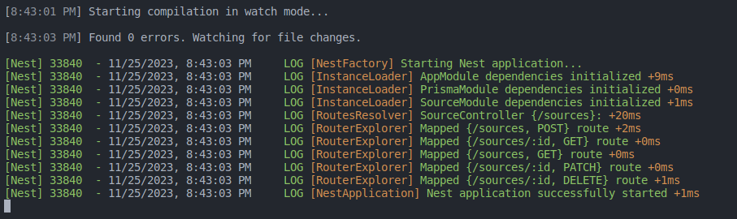
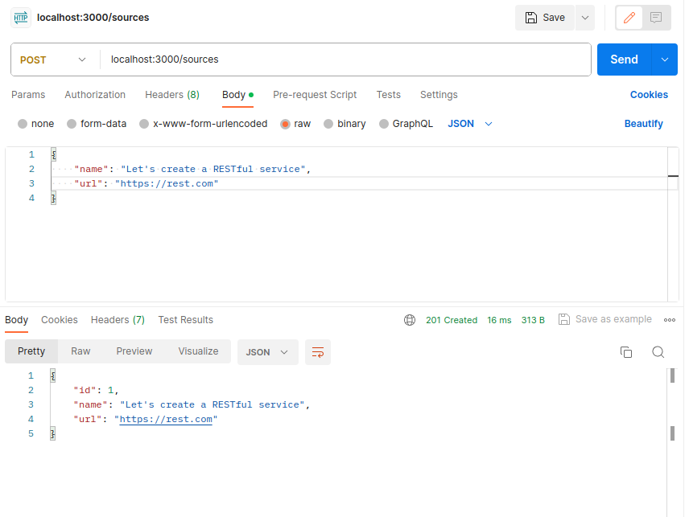
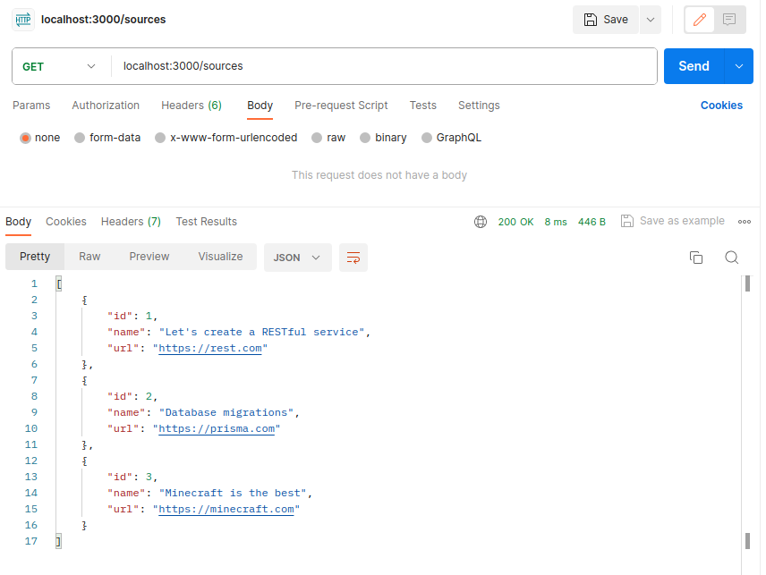
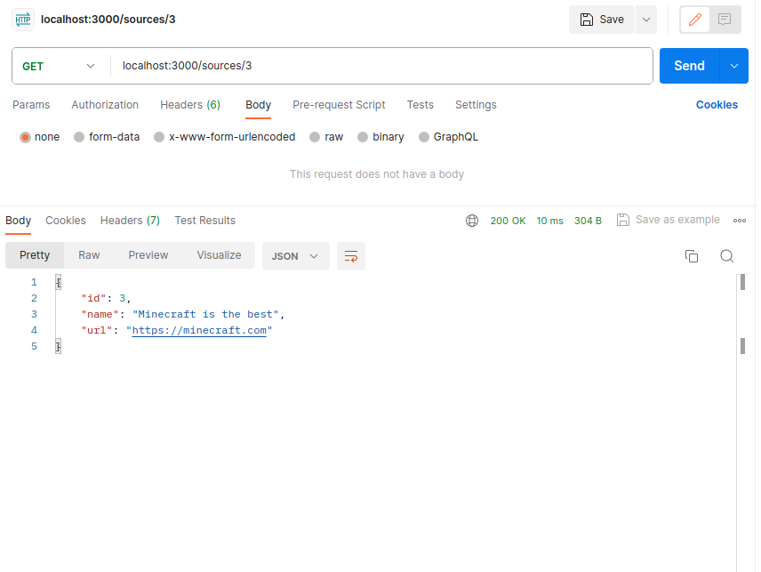
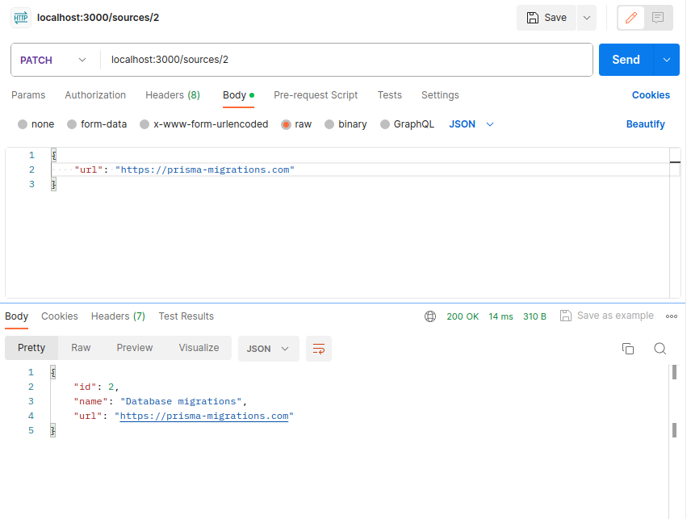
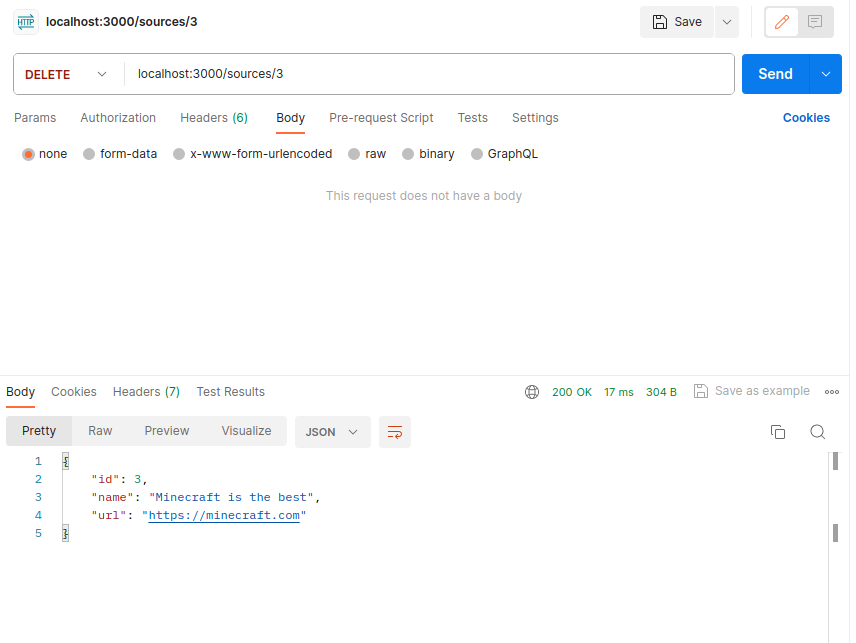
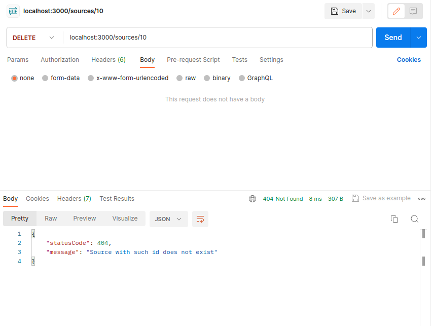
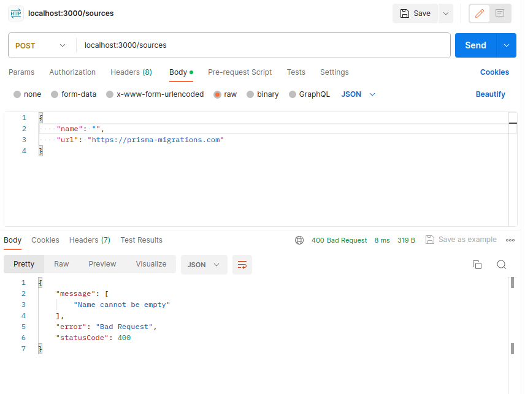
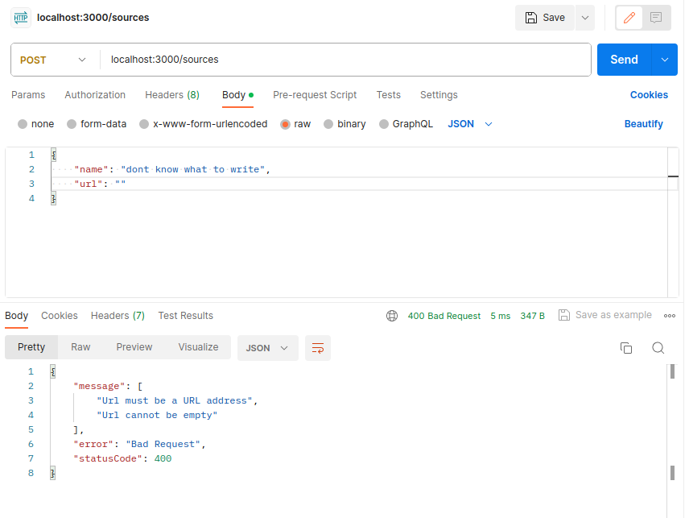

# Тестування працездатності системи

## Starting Nest application

  

## POST /sources

  

## GET(all) /sources

  

## GET /sources/:id

  

## PATCH /sources/:id

  

## DELETE /sources/:id

  

## Exception: Source with such id does not exist

  

## Exception: Name cannot be empty

  

## Exception: Name must be a string

  

## Exceptions: Url cannot be empty and Url must be a URL address

  

